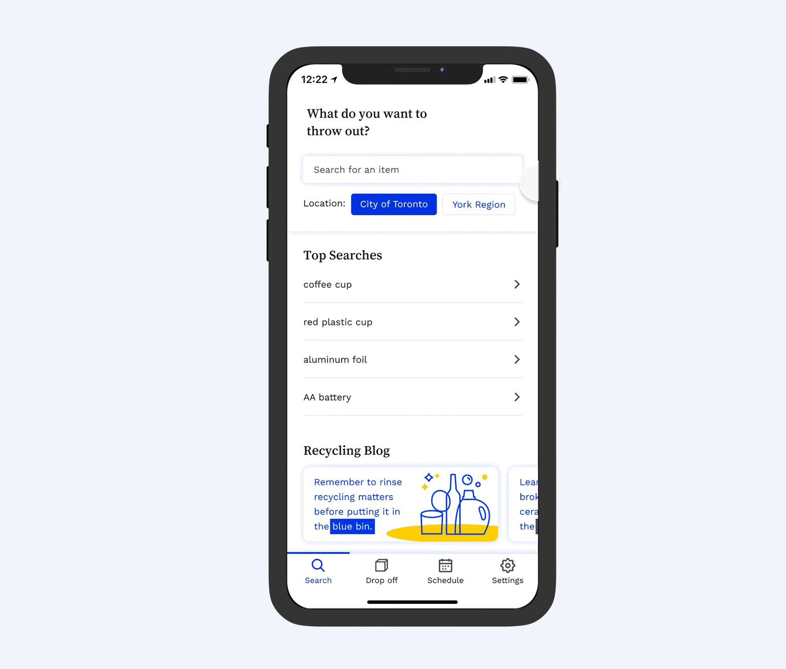

# Littr App

Hi there, the Littr App is a personal project for learning and creating my first React Native app utilizing Expo.

The product itself and UI Designs belong to [Ashley Fong](http://ashleyfong.ca/), who I am working together with to make this app idea come to life.

Currently in the process of finishing touches and reading about publishing the apps to Google Play and App Store respectively.

## About the App

*** Prototype of Designs ***

### What does this app do?
 - Search up how to dispose of particular items in your local municipality.
  - Currently supports "York Region" and "City of Toronto"
 - Find out local waste depots, and details on what each depot accepts.

### Why?
 - You can read up on this from [Ashley's Portfolio](https://www.ashleyfong.ca/waste-disposal-app).

### Disclaimer
 - The data being used to render information was taken from York Region's Bindicator, and City of Toronto's Waste Wizard and is not updated in real time with the base data.

### Known Issues
 - pageMargin on iOS not displaying correctly for the cards. [react-native-viewpager](https://github.com/react-native-community/react-native-viewpager/issues/206)
 - Some entries in data showing up twice.
  - Need to manually clean up and organize parts of the dataset.

---

## Learnings from making this App | Dev Journal

### Exposure to Tools and Interactions
Thanks to being able to work with a Product Designer on this project, I was fortunate enough to be exposed to many tools that I would have never used without any work experiences.

#### Miro Board:
- Brain storming session, feature prioritization, MVP consistent between team members.

#### Figma:
- Wireframes, app flow, CSS details, screen designs.

#### Notion:
- Kanban board, weekly sprint planning and meetings, sharing of resources.

#### Communication:
- Discussions, how to flag concerns and limitations from a technical perspective and communicate them appropriately, exchanging ideas and solutions for moving forward.

### Data Set

Initially when building the rendering logic for this app, we started off using York Region's bindicator dataset which was organized in a certain way. Knowing that we are at the mercy of how each municipality keeps their data organized, there was no "catch-all" way of considering how to easily translate and render the data onto the app in the same format.

As focusing on this would hinder any progress of my learning, we went forward with York Region's structure first, and then did some manipulation of "City of Toronto"s data set to match York Region's format through Scripts and manual entries. Definitely not the ideal method in terms of scalability, but it was a great reminder for me that Data organization and structure are really important aspect of long term scalability.

### Firebase Data Sizes

Initially I was planning to host the whole dataset onto firebase and saving it to local storage (along with a data version check to redownload as needed, and after intial load the app would technically still be usable offline for looking up disposal information). Realizing how big the data was and finding out shallow queries not being available (from what I've read), I would have hit my bandwidth limit on the free-tier really quick and opted to store only the "top searches" in firebase using the minimal amount of data transfer possible on app load.

I only have had experience with Firebase Real Time Database due to ease of use, and finding some interest in exploring the back-end side of development.

### Data Fetching

The biggest learning for me personally, is trying to figure out the "where and when"s of fetching data. Luckily this article provided me insight into different patterns of data fetching which helped in what I can change to for scalability when expanding the data set using a back-end that provides a shallow query for less data-intensive fetching.
- Article: ['Patterns for data fetching in React' by Gigi Sayfan](https://blog.logrocket.com/patterns-for-data-fetching-in-react-981ced7e5c56/)

### Self Notes / Reminder / Fluff

- Don't upgrade versions just because there's a new one available, package compatibility is a rabbit hole to avoid if possible..
- Did a lot more of refactoring code once it started to get too long,but need to do it more frequently. 
- Hammer in the habit of Functional Programming concepts of separating each function to do 1 thing and 1 thing only.
- Do next project in bare React-Native, w/ TypeScript, Jest focusing on Android (since I have no Apple products..)

### Takeaway

The biggest takeaway is that I really enjoyed working on Mobile Development using Expo/React Native! Developing an App was such a fun experience that I may stick solely to RN for future projects, and/or possibly learn some Kotlin.

### Hiring?

The Developer (Me) is currently looking for his first Front End position! 

Please contact [steveseki88@gmail.com](mailto:steveseki88@gmail.com) for any available Jr. Front End positions, it would be much appreciated.

Thank you for taking interest in reading about this project.